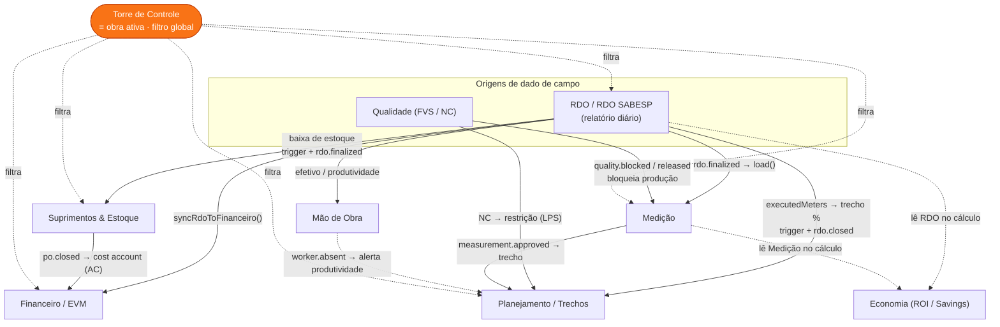

# Documentação da Plataforma — Índice & Mapa de Integrações

> **O que é este documento:** a porta de entrada da documentação de plataforma do ConstruData. Aqui ficam (1) o índice para o documento-mãe e para cada módulo, (2) o **mapa das integrações** — a "camada única" que faz o dado nascer uma vez e seguir conectado — e (3) a referência técnica dos mecanismos que sustentam essa camada (eventos, funções cross-module, triggers SQL e Realtime).
>
> **Como as integrações funcionam, em uma frase:** o dado nasce numa origem (RDO, Medição, Planejamento, Suprimentos, Qualidade) e se propaga por **três camadas** — (1) `eventBus` no cliente, (2) triggers SQL no Postgres, (3) Supabase Realtime por organização — descritas ao final. O `src/store/crossModuleSync.ts` é o "guardião" declarado dessas travessias entre módulos ([código] `src/store/crossModuleSync.ts:1-16`).

---

## Índice

**Documento-mãe**
- [`00-visao-geral.md`](00-visao-geral.md) — Visão geral da plataforma: a tese "camada única" / connected construction, ICP, stack (React 19 + Zustand + Supabase + Vercel), a ontologia de 4 camadas e o mapa dos 20+ módulos conectados.

**Módulos** (`docs/plataforma/modulos/`)

| # | Documento | Módulo — descrição |
|---|-----------|--------------------|
| 01 | [`01-gestao-360.md`](modulos/01-gestao-360.md) | **Gestão 360** — painel executivo/diretoria que consolida saúde, custo e avanço de todas as obras a partir das tabelas-fonte. |
| 02 | [`02-torre-de-controle.md`](modulos/02-torre-de-controle.md) | **Torre de Controle (Obras)** — cadastro e seleção da **obra ativa**; a obra escolhida vira o filtro global que os demais módulos respeitam. |
| 03 | [`03-suprimentos.md`](modulos/03-suprimentos.md) | **Suprimentos & Estoque** — pedidos de compra, recebimentos, notas, depósitos e movimentações de estoque; alimenta EVM (custo real) e é baixado pelo RDO. |
| 04 | [`04-medicao.md`](modulos/04-medicao.md) | **Medição** — medição unificada por período: consolida origens (RDO, subempreiteiro, manual), aplica gates de qualidade/suprimentos e gera memória e financeiro. |
| 05 | [`05-planejamento-mestre.md`](modulos/05-planejamento-mestre.md) | **Planejamento (Mestre + LPS/Lean)** — cronograma mestre, plano de execução e Last Planner System (lookahead, restrições, PPC). |
| 06 | [`06-planejamento-trechos.md`](modulos/06-planejamento-trechos.md) | **Planejamento de Trechos (Rede)** — planejamento linear por trecho (metros executados), sincronizado com o avanço lançado no RDO. |
| 07 | [`07-agenda.md`](modulos/07-agenda.md) | **Agenda** — compromissos, marcos e eventos da obra, local-first e sincronizados por organização. |
| 08 | [`08-financeiro-evm.md`](modulos/08-financeiro-evm.md) | **Financeiro (EVM · DRE · Fluxo · Pagamentos · Distribuição)** — Earned Value, contas de custo, DRE, fluxo de caixa e pagamentos; recebe custo real de PO fechada e de RDO. |
| 09 | [`09-quantitativos.md`](modulos/09-quantitativos.md) | **Quantitativos** — levantamento de quantidades/planilhas de serviços que abastecem planejamento e medição. |
| 10 | [`10-rdo.md`](modulos/10-rdo.md) | **RDO — Relatório Diário de Obra** — origem de dado de campo (serviços, efetivo, trechos, estoque); ao finalizar, propaga para Planejamento, Suprimentos, Medição e Financeiro. |
| 11 | [`11-rdo-sabesp.md`](modulos/11-rdo-sabesp.md) | **RDO SABESP** — variante do RDO no padrão SABESP, com parser de documentos e ativos duráveis próprios. |
| 12 | [`12-qualidade.md`](modulos/12-qualidade.md) | **Qualidade (FVS)** — Fichas de Verificação de Serviço e Não Conformidades; abrir NC bloqueia a Medição e gera restrição no LPS. |
| 13 | [`13-mao-de-obra.md`](modulos/13-mao-de-obra.md) | **Mão de Obra** — trabalhadores, equipes, turnos e ausências; ausência dispara alerta de produtividade para o Planejamento. |
| 14 | [`14-predial.md`](modulos/14-predial.md) | **Predial (Manutenção · Ativos · CapEx · Rateio)** — gestão predial: manutenções, ativos, CapEx e rateio de custos. |
| 15 | [`15-economia.md`](modulos/15-economia.md) | **Economia (ROI / Savings)** — baselines, eventos de economia e valoração; deriva savings/ROI lendo RDO e Medição. |
| 16 | [`16-bim.md`](modulos/16-bim.md) | **BIM** — modelos e segmentos BIM (mantidos fora do Realtime por serem tabelas pesadas). |
| 17 | [`17-mapa-interativo.md`](modulos/17-mapa-interativo.md) | **Mapa Interativo** — visualização geoespacial de obras, trechos e ativos. |
| 18 | [`18-frota.md`](modulos/18-frota.md) | **Frota Veicular & Otimização de Frota** — cadastro de frota, geolocalização e otimização de alocação de veículos. |
| 19 | [`19-campo-rede-360.md`](modulos/19-campo-rede-360.md) | **Operação de Campo & Rede 360** — operação de campo e visão de rede consolidada (Rede 360). |
| 20 | [`20-pre-construcao-projetos.md`](modulos/20-pre-construcao-projetos.md) | **Pré-Construção & Projetos** — fase de pré-construção, documentos e gestão de projetos. |
| 21 | [`21-admin-governanca.md`](modulos/21-admin-governanca.md) | **Admin & Governança (Membros · Aprovações · Auditoria · LGPD)** — membros, papéis, fluxo de aprovações, `audit_log` e LGPD. |
| 22 | [`22-inicio-minha-rotina.md`](modulos/22-inicio-minha-rotina.md) | **Início / Minha Rotina** — home do usuário e sua rotina/tarefas do dia, agregando pendências dos demais módulos. |

> Nota: alguns arquivos de módulo (10, 11, 18–22) podem ainda estar em redação; os links acima já refletem o caminho e o slug definitivos.

---

## Mapa de integrações (a "camada única")

O RDO (e o RDO SABESP) é a principal **origem** de dado de campo e irriga os demais módulos. A **Torre de Controle** não é um destino de dado: ela define a **obra ativa** (`activeObraStore`, `activeObraId === null` = "Todas as obras"), que funciona como filtro global de tudo ([código] `src/store/activeObraStore.ts:2-34`).

Linhas cheias = propagação de dado com mecanismo cravado no código (evento/trigger/função). Linhas tracejadas = leitura cross-store sob demanda, alerta ainda não emitido, ou o filtro de obra ativa.

### Origem → Destino → Mecanismo → Arquivo

| Origem | Destino | Mecanismo | Arquivo(s) : linha |
|--------|---------|-----------|--------------------|
| RDO (finalizado) | Planejamento de Trechos | **Trigger SQL** `trg_rdo_to_planejamento` grava `plan_trechos.payload.executedMeters` (GREATEST, não regride) + `updated_at=now()` | `supabase/migrations/0035_cross_module_triggers.sql:20-60` |
| RDO (finalizado) | Planejamento de Trechos | **Evento** `rdo.closed` → `planejamentoStore.pull()` (reflete o que o trigger gravou) | emite `src/store/rdoStore.ts:298,364` · escuta `src/store/planejamentoStore.ts:1103-1105` |
| RDO (finalizado) | Planejamento de Trechos | **Função cross-store** `syncExecutionToPlanejamento()` reconcilia executado (roda mesmo em rascunho, filtra finalizados) | `src/store/rdoStore.ts:322,368` · adapter `src/store/crossModuleSync.ts:202-233` |
| RDO (finalizado) | Suprimentos / Estoque | **Trigger SQL** `trg_rdo_to_estoque` baixa estoque (gated em `payload.status='finalizado'`) | `supabase/migrations/20260625120000_rdo_estoque_integration.sql:36,114-115` |
| RDO (finalizado) | Suprimentos / Estoque | **Evento** `rdo.finalized` → `suprimentosStore.pull()` (reflete saldos/movimentações) | emite `src/store/rdoStore.ts:304,365` · escuta `src/store/suprimentosStore.ts:1618-1620` |
| RDO (finalizado) | Medição | **Evento** `rdo.finalized` → `medicaoUnificadaStore.load()` | emite `src/store/rdoStore.ts:365` · escuta `src/store/medicaoUnificadaStore.ts:728-730` |
| RDO (finalizado/rascunho) | Financeiro | **Função cross-store** `syncRdoToFinanceiro(rdo)` posta custos se finalizado, remove se virou rascunho | chama `src/store/rdoStore.ts:323,369` · impl. `src/store/financeiroStore.ts:179` |
| RDO + Medição | Economia | **Leitura cross-store** `getState()` no cálculo de savings/ROI | `src/store/economiaStore.ts:206-218` |
| Qualidade (abre NC) | Medição | **Evento** `quality.blocked` (e `quality.released`) → `medicaoUnificadaStore.load()` bloqueia produção sob NC | emite `src/store/qualidadeStore.ts:33-53` · escuta `src/store/medicaoUnificadaStore.ts:731-736` |
| Qualidade (abre NC) | Planejamento (LPS) | **Trigger SQL** `trg_fvs_nc_to_lps` insere `lps_restrictions` (idempotente por `fvs_id`+`nc_number`) | `supabase/migrations/0035_cross_module_triggers.sql:118-172` |
| Qualidade (abre NC) | Planejamento (LPS) | **Evento** `fvs.nc_opened` → `lpsStore` re-pull das restrições | emite `src/store/qualidadeStore.ts:33` · escuta `src/store/lpsStore.ts:620` |
| Qualidade (abre NC) | Planejamento (LPS) | **Função cross-store** `getOpenNcsAsRestrictions()` monta restrições a partir das FVS com NC | `src/store/crossModuleSync.ts:171-191` |
| Qualidade | RDO | **Função cross-store** `checkPendingFvsForDate()` impede fechar RDO com FVS pendente na data | `src/store/crossModuleSync.ts:61-95` |
| Suprimentos (PO → `closed`) | Financeiro / EVM | **Trigger SQL** `trg_po_to_evm` insere `evm_cost_accounts` (`source='po_auto'`, AC real, idempotente por `po_id`) | `supabase/migrations/0035_cross_module_triggers.sql:69-109` |
| Suprimentos (PO → `closed`) | Financeiro / EVM | **Evento** `po.closed` → `evmStore.pull()` + `recalculateMetrics()` | emite `src/store/suprimentosStore.ts:703` · escuta `src/store/evmStore.ts:923-927` |
| Suprimentos (recebimento/nota) | Medição | **Eventos** `supply.receipt_approved` / `supply.invoice_approved` → `medicaoUnificadaStore.load()` | emite `src/store/suprimentosStore.ts:736,759` · escuta `src/store/medicaoUnificadaStore.ts:737-742` |
| Suprimentos (material atrasa) | Planejamento de Trechos | **Função cross-store** `applyMaterialDelayToPlanejamento(keywords, dias)` marca trechos afetados como dirty | `src/store/crossModuleSync.ts:115-155` |
| Medição (aprovada) | Planejamento de Trechos | **Evento** `measurement.approved` (com `operationalKey`) → casa trecho por serviço/local e atualiza executado | emite `src/store/medicaoUnificadaStore.ts:542` · escuta `src/store/planejamentoStore.ts:1106-1132` |
| Medição (rascunho/bloqueada/aprovada) | Torre de Controle | **Eventos** `measurement.draft_created` / `blocked` / `approved` → `torreStore.pull()` | emite `src/store/medicaoUnificadaStore.ts:501,508,542` · escuta `src/store/torreDeControleStore.ts:274-282` |
| Mão de Obra (ausência) | Auditoria / Planejamento | **Trigger SQL** `trg_worker_absent_notify` grava `audit_log` (`action='worker_absent'`); evento cliente `worker.absent` reservado p/ alerta de produtividade | `supabase/migrations/0035_cross_module_triggers.sql:180-203` · tipo `src/lib/eventBus.ts:55` |
| Planejamento (Execução importada) | LPS / Mestre | **Evento** `planning.activity_imported` → LPS e Mestre re-puxam | emite `src/store/planoExecucaoStore.ts:30` · escuta `src/store/lpsStore.ts:637`, `src/store/planejamentoMestreStore.ts:670` |
| Planejamento Mestre (atividade atrasa) | Plano de Execução | **Evento** `master_activity.delayed` → propaga atraso à origem na Execução | emite `src/store/planejamentoMestreStore.ts:232` · escuta `src/store/planoExecucaoStore.ts:267` |
| Qualquer tabela observada | Todos os stores | **Realtime → evento** `realtime.row_changed` (coalescido ~350ms) → re-pull do store dono da tabela | `src/lib/realtime.ts:85-137` (ver seção Realtime) |
| Qualquer projeto | KPIs | **RPC** `recompute_project_kpis(uuid)` recalcula BAC/AC/%/restrições/NCs/RDOs no servidor | `supabase/migrations/0035_cross_module_triggers.sql:213-287` |

---

## Eventos do `eventBus`

O `eventBus` (`src/lib/eventBus.ts`) é um pub/sub interno **tipado e síncrono** (Camada 1 da ontologia). Não tem estado próprio, é complementar ao Zustand ([código] `src/lib/eventBus.ts:1-8,75-124`). `emit()` roda todos os handlers em sequência e engole exceções com `console.warn` ([código] `src/lib/eventBus.ts:79-89`). Em browser fica exposto como `window.__eventBus` para debug ([código] `src/lib/eventBus.ts:127-129`).

Todos os tipos são declarados na união `DomainEvent` ([código] `src/lib/eventBus.ts:33-64`). Tabela dos tipos reais, quem emite e quem escuta:

| Evento (`type`) | Payload principal | Emitido por | Escutado por (reação) |
|-----------------|-------------------|-------------|-----------------------|
| `rdo.closed` | `rdoId, projectId, date` | `rdoStore.ts:298,364` (RDO finalizado) | `planejamentoStore.ts:1103` → `pull()` |
| `rdo.finalized` | `rdoId, date, operationalKey` | `rdoStore.ts:304,365` | `suprimentosStore.ts:1618`, `medicaoUnificadaStore.ts:728`, `lpsStore.ts:633` → re-pull/`load()` |
| `po.closed` | `poId, totalBrl` | `suprimentosStore.ts:703` | `evmStore.ts:923` → `pull()` + `recalculateMetrics()` |
| `supply.receipt_approved` | `receiptId, poId, operationalKey` | `suprimentosStore.ts:736` | `medicaoUnificadaStore.ts:737` → `load()` |
| `supply.invoice_approved` | `invoiceId, poId, amount, operationalKey` | `suprimentosStore.ts:759` | `medicaoUnificadaStore.ts:740` → `load()` |
| `fvs.nc_opened` | `fvsId, ncNumber, description` | `qualidadeStore.ts:33` (NC nova) | `lpsStore.ts:620` → re-pull restrições |
| `quality.blocked` | `qualityId, reason, operationalKey` | `qualidadeStore.ts:40` | `medicaoUnificadaStore.ts:731` → `load()` |
| `measurement.draft_created` | `sourceId, operationalKey` | `medicaoUnificadaStore.ts:501` | `torreDeControleStore.ts:274` → `pull()` |
| `measurement.blocked` | `sourceId, blockingIssues` | `medicaoUnificadaStore.ts:508` | `lpsStore.ts:626`, `torreDeControleStore.ts:277` |
| `measurement.approved` | `sourceId, quantity, amount, operationalKey` | `medicaoUnificadaStore.ts:542` | `planejamentoStore.ts:1106` (casa trecho), `lpsStore.ts:623`, `torreDeControleStore.ts:280` |
| `planning.activity_imported` | `activityId, projectId` | `planoExecucaoStore.ts:30` | `lpsStore.ts:637`, `planejamentoMestreStore.ts:670` |
| `master_activity.delayed` | `activityId, delayDays` | `planejamentoMestreStore.ts:232` | `planoExecucaoStore.ts:267` (propaga atraso) |
| `realtime.row_changed` | `table, rowId, organizationId` | `realtime.ts:92` (coalescido) | `planejamentoStore`, `suprimentosStore`, `medicaoUnificadaStore`, `evmStore`, `torreDeControleStore`, `planejamentoMestreStore`, `planoExecucaoStore`, `economiaStore`, `lpsStore`, `comando-central` (cada um filtra suas tabelas) |
| `lps.commitment_updated` | `commitmentId, operationalKey` | — (reservado) | `lpsStore.ts:629` |

**Tipos declarados ainda sem emissor** (reservados para integrações futuras, apenas na união de tipos): `po.received` (`eventBus.ts:40`), `fvs.nc_resolved` (`:46`), `quality.released` (`:48`, já escutado em `medicaoUnificadaStore.ts:734`), `worker.absent` (`:55`, hoje resolvido via trigger `audit_log`), `equipment.allocated` (`:57`), `project.created` / `project.updated` (`:61-62`). São parte do contrato tipado, mas nenhum `eventBus.emit` os dispara ainda.

**`operationalKey`** (`src/lib/eventBus.ts:23-31`) é a "chave operacional" comum que viaja nos eventos (`contractNo, projectId, nucleo, local, serviceCode, nPreco, period`), montada por `buildOperationalKey()` — é o que permite casar um RDO com o trecho/medição/serviço certo mesmo sem foreign key formal (ex.: `planejamentoStore.ts:1106-1132` usa `operationalKey` para achar o trecho de destino).

---

## Padrão de sincronização

### 1. Local-first: `pendingSync` → `flushQueue`

Cada store Zustand escreve **primeiro no estado local** (e `localStorage`) e enfileira a operação em `pendingSync`; um `flush()` drena a fila contra o Supabase. O helper compartilhado é `src/lib/storeSync.ts` ([código] `src/lib/storeSync.ts:1-11`).

- **Enfileirar:** a mutação otimista adiciona um `PendingOp` (`{ entity, type: insert|update|delete, recordId, row/patch, table, approvalActionType?, retries }`) a `pendingSync` e chama `void get().flush()` ([código] `src/lib/storeSync.ts:47-72`; ex. `src/store/rdoStore.ts:297-300`, `src/store/suprimentosStore.ts:736-744`).
- **Drenar:** `flushQueue(queue)` despacha cada op pelo `entity`, retornando `{ completed, errored, lastError }` — ops que falham **ficam na fila** e incrementam `retries` (retry), com `syncError` mostrando o motivo ([código] `src/lib/storeSync.ts:100-...`). Conflitos: **last-write-wins** por `updated_at` do servidor ([código] `src/lib/storeSync.ts:10`).
- **Robustez de canteiro:** cada requisição tem teto de `SYNC_TIMEOUT_MS = 20s` via `AbortController` + `withTimeout`; no estouro a op volta pra fila e o status vira `error` (dado seguro no aparelho) ([código] `src/lib/storeSync.ts:18-42`). Offline (`navigator.onLine === false`) e sem perfil/usuário: o flush retorna sem tocar a rede ([código] `src/lib/storeSync.ts:104-117`).
- **Reparos de fila:** ops enfileiradas antes do login carregam `organization_id`/`created_by = 'pending'`; `flushQueue` conserta para a org/usuário ativos e coage colunas `*_id` vazias para `null` antes de enviar (senão a RLS `created_by = auth.uid()` ou o tipo `uuid` rejeitariam para sempre) ([código] `src/lib/storeSync.ts:119-140`).
- **Confirmação:** `assertAffectedRows` exige ≥1 linha afetada; zero linhas vira erro explícito ("Verifique RLS, organização ativa ou se o registro ainda existe") ([código] `src/lib/storeSync.ts:87-91`). `SyncStatus` = `idle | syncing | offline | unauth | error`.

### 2. Realtime por organização

`src/lib/realtime.ts` (Camada 3) inscreve **um único channel global por organização** (`org-changes:{orgId}`) e escuta `postgres_changes` (`event: '*'`) em uma lista enxuta de tabelas críticas, **sempre filtrando por `organization_id=eq.{orgId}`** ([código] `src/lib/realtime.ts:101-137`). Tabelas pesadas (segmentos BIM, fotos) ficam de fora de propósito ([código] `src/lib/realtime.ts:30-62`).

- **Ciclo de vida:** `subscribeOrgRealtime(orgId)` é idempotente (mesma org → reutiliza; org mudou → fecha o anterior); `unsubscribeOrgRealtime()` roda no logout. Ligado/desligado pelo `AuthGuard` conforme `profile.organization_id`/`session` ([código] `src/lib/AuthGuard.tsx:23-33`).
- **Coalescer (~350ms):** sem isto, importar 500 linhas emitiria 500 `realtime.row_changed` e cada store re-puxaria a tabela inteira 500×. O buffer junta as tabelas alteradas numa janela e emite **uma vez por tabela por janela** ([código] `src/lib/realtime.ts:67-95`).
- **Fechando o loop:** cada mudança vira `eventBus.emit({ type: 'realtime.row_changed', table, rowId, organizationId })`; o store dono da tabela filtra pelo `event.table` e re-puxa — a UI de todos os clientes atualiza sozinha ([código] `src/lib/realtime.ts:9-22,91-93`; ex. filtros em `src/store/medicaoUnificadaStore.ts:743-758`, `src/store/evmStore.ts:928-933`).

### 3. As três camadas (resumo)

| Camada | Onde | Papel |
|--------|------|-------|
| **1 — `eventBus`** | cliente (`src/lib/eventBus.ts`) | domain events tipados e síncronos entre stores no mesmo navegador |
| **2 — Triggers SQL** | servidor (`supabase/migrations/0035_...` e `20260625120000_...`) | verdade única no Postgres: RDO→trechos, PO→EVM, FVS→LPS, ausência→audit, baixa de estoque. Idempotentes. `SECURITY DEFINER` |
| **3 — Realtime** | Supabase → cliente (`src/lib/realtime.ts`) | propaga mudanças **entre clientes** da mesma org; vira `realtime.row_changed` no eventBus |

### 4. RLS / multi-tenant

Todo o isolamento é **por `organization_id`** (multi-tenant). O Realtime nunca escuta sem o filtro `organization_id=eq.{orgId}` ([código] `src/lib/realtime.ts:127`); os triggers propagam sempre dentro do mesmo `NEW.organization_id` ([código] `supabase/migrations/0035_cross_module_triggers.sql:47,98,157`); as RPCs validam o tenant via `public.user_org()` antes de retornar (ex.: `recompute_project_kpis` levanta `42501` se o projeto não for da org do usuário — `supabase/migrations/0035_cross_module_triggers.sql:216,226-231`). No cliente, `flushQueue` conta com a RLS: quando um INSERT/UPDATE não afeta linha alguma, o erro instrui a checar **RLS, organização ativa ou existência do registro** ([código] `src/lib/storeSync.ts:87-91`).
